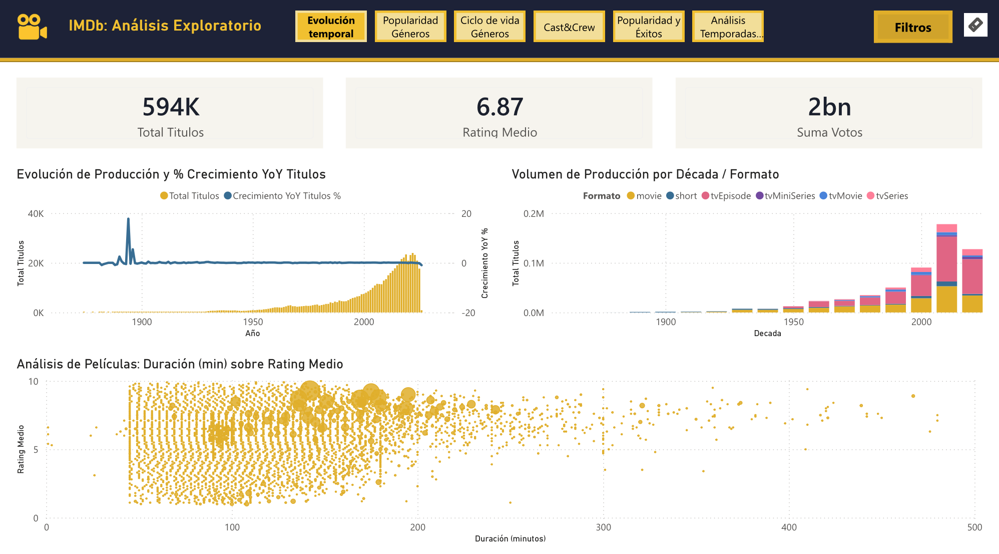
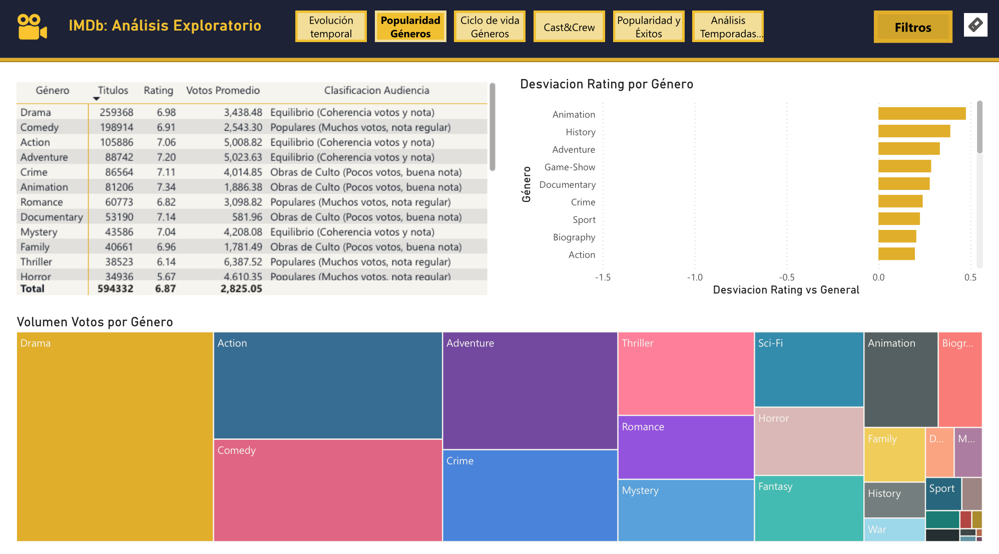
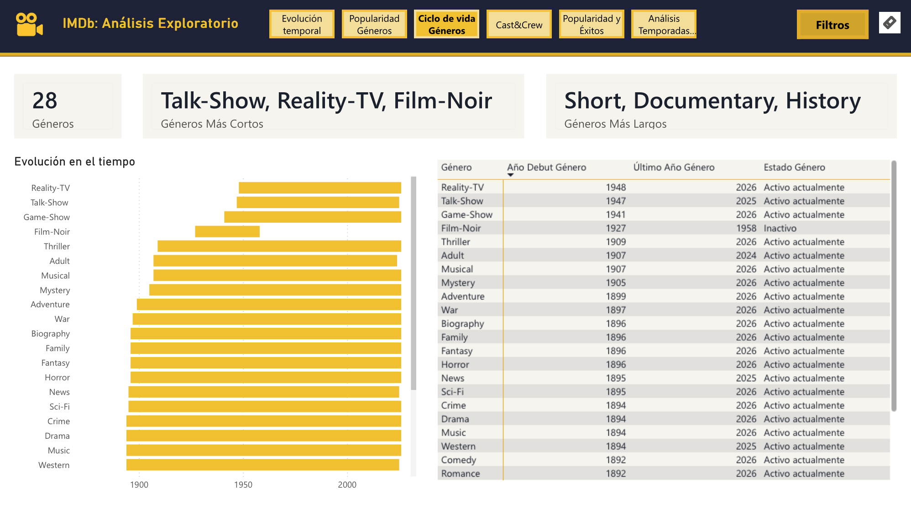
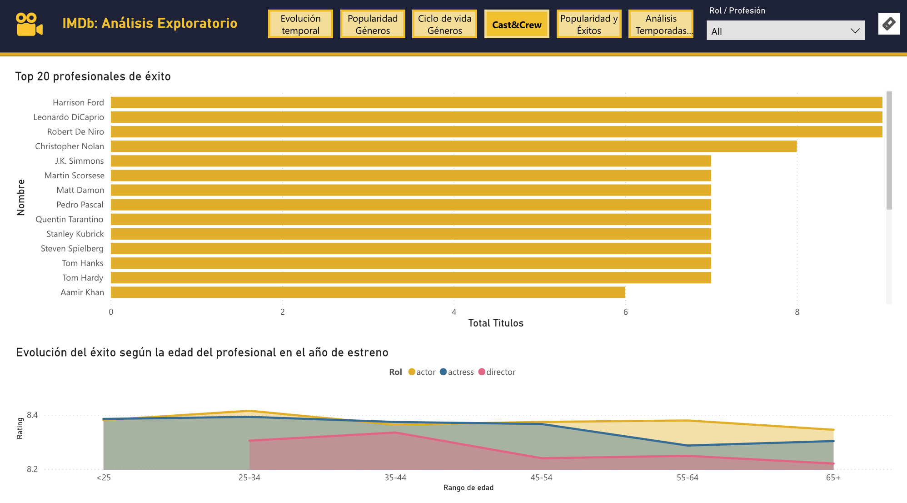
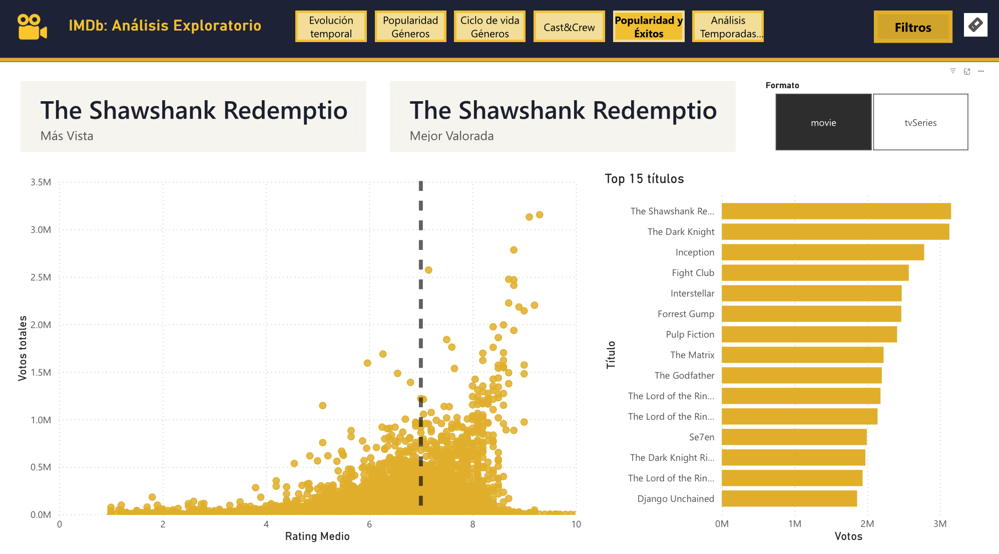
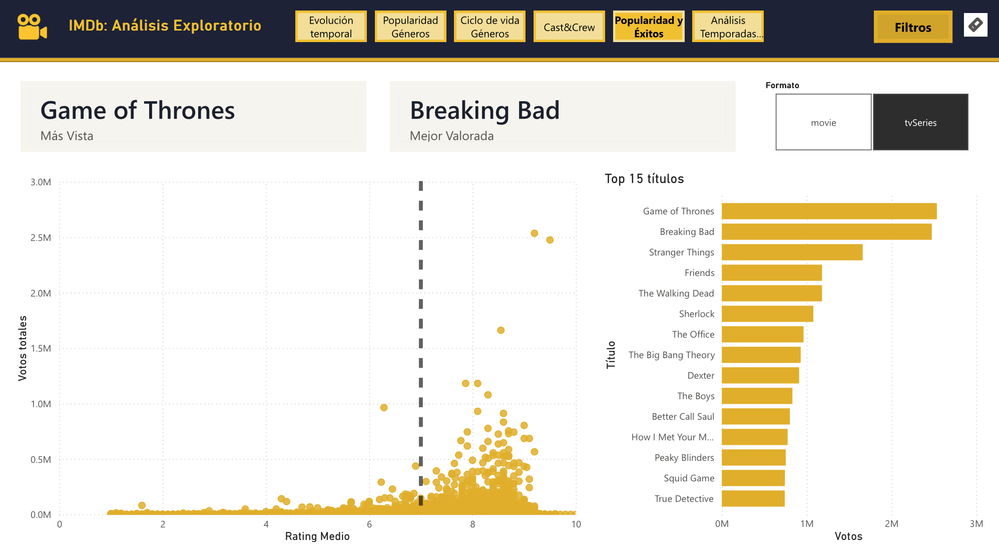
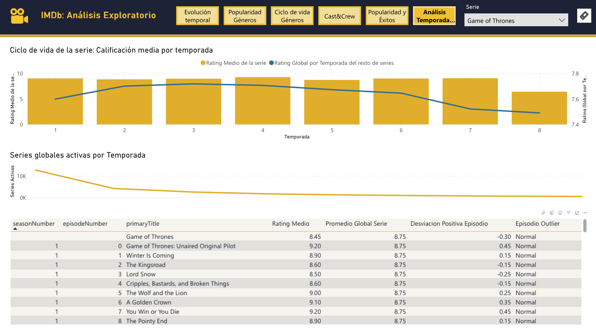

# IMDb: Análisis Exploratorio de Datos mediante Bases de Datos Relacionales y Visualización en Power BI

> **Trabajo Fin de Máster (TFM)**\
> **Máster de Formación Permanente en Ciencia de Datos y Matemática Computacional**\
> *Universidad de Almería (Julio 2026)*\
> **Autora:** Cristina Ganfornina Fuentes

------------------------------------------------------------------------

## Resumen del Proyecto

Este proyecto aborda el diseño, la implementación y la explotación de una arquitectura de datos relacional en la nube para realizar un **Análisis Exploratorio de Datos (EDA)** sobre el sector cinematográfico, utilizando los datasets públicos y oficiales de **IMDb**.

El flujo de trabajo abarca desde el procesamiento y limpieza de los datos en bruto (gigabytes en formato TSV) mediante un pipeline de **ETL en Python**, pasando por el diseño de un modelo dimensional implementado en **Aiven MySQL Cloud**, hasta la explotación analítica mediante **consultas SQL avanzadas** y su posterior visualización interactiva en un cuadro de mando en **Power BI Desktop**.

------------------------------------------------------------------------

## Arquitectura y Stack Tecnológico

El pipeline de datos sigue un esquema clásico de almacenamiento, transformación y explotación visual:

[ IMDb TSV (Origen) ] ➔ [ Python - Pandas (ETL) ] ➔ [ Aiven MySQL Cloud ] ➔ [ Power BI (BI & Dashboard) ]

-   **Lenguaje de Programación:** Python 3 (Pandas, SQLAlchemy, PyMySQL).
-   **Entorno de Desarrollo:** Jupyter Notebooks.
-   **Base de Datos Cloud:** Aiven MySQL.
-   **Business Intelligence:** Power BI Desktop.

------------------------------------------------------------------------

## Estructura del Repositorio

-   `notebooks/`: Contiene los Notebooks principales con el código documentado del proceso ETL (`etl_imdb.ipynb`) y las consultas analíticas de SQL (`sql_imdb.ipynb`).
-   `power_bi/`: Contiene las capturas de pantalla detalladas de las diferentes pestañas y análisis interactivos desarrollados en el cuadro de mando de Power BI Desktop.
-   `reports/`: Contiene la memoria final del TFM en formato PDF (`memoria-imdb.pdf`).
-   `sql/`: Archivo DDL (`ddl_schema.sql`) para la creación física de las tablas e índices en el servidor MySQL.

------------------------------------------------------------------------

## Fases del Desarrollo

### 1. Extracción, Transformación y Limpieza (ETL)

El dataset original supera varios gigabytes y decenas de millones de registros, por lo que se aplicaron filtros para mitigar el sesgo estadístico y cumplir las restricciones de almacenamiento cloud:

- **Filtro de Calidad (Umbral de Votos):** Se excluyeron títulos con menos de 50 votos ($\ge50$), reduciendo el volumen a 594.332 registros más representativos del mercado.

- **Tratamiento de Nulos y Outliers:** Limpieza del literal `\N` propio de IMDb, eliminación de anomalías (duraciones de películas \> 8 horas o números de temporadas de series \> 100 por errores de formato).

- **Optimización de Roles:** Filtrado de profesionales conservando únicamente *actores, actrices y directores*.

### 2. Diseño del Modelo Dimensional (Star Schema)

Se implementó un modelo en estrella optimizado para analítica, compuesto por:

- **Tablas de Hechos:** `H_RATINGS` (métricas de puntuación y votos) y `H_PRINCIPALS` (relación profesional-título).

- **Tablas de Dimensiones:** `DIM_TITLES` (con un bucle autorreferencial `parentTitleID` para relaciones de series/episodios), `DIM_NAMES`, `DIM_GENRES`, y `DIM_FECHA`.

- **Tablas Puente:** `H_TITLES_GENRES` para resolver la relación de muchos a muchos ($M:N$) de los géneros sin duplicar información.

### 3. Explotación Analítica en SQL (Aiven MySQL)

Se resolvieron preguntas de negocio mediante consultas SQL, haciendo uso de:

- Funciones analíticas de ventana (`LAG()`, `RANK()`, `PARTITION BY`).

- Common Table Expressions (CTEs) y subconsultas.

- *Insights obtenidos:* Impacto del COVID-19 en la industria (caída del -21.42% en películas en 2020), índice de discrepancia de la audiencia por géneros (obras de culto vs. blockbusters comerciales), y análisis del desgaste de calidad por temporadas en series de TV (ej. el declive de la última temporada de *Game of Thrones*).

------------------------------------------------------------------------

## Dashboard Interactivo (Power BI)

El cuadro de mando final se conecta por SSL a la nube de Aiven e integra 6 vistas de análisis avanzado:

1.  **Evolución Temporal:** Análisis del crecimiento exponencial de títulos y cambio de hábitos de consumo hacia el formato serie (`tvEpisode`).

2.  **Popularidad de Géneros:** Desviación de calificaciones frente a la media global ($6.87$) y volumen de *engagement*.

3.  **Ciclo de Vida de Géneros:** Análisis histórico de los 28 géneros activos e inactivos (ej. *Film-Noir*).

4.  **Cast & Crew (Factor Humano):** Curvas de madurez creativa. Muestra que los actores/actrices logran su pico entre los 25-44 años, mientras que los directores alcanzan el éxito en etapas más avanzadas ($35-54$ años).

5.  **Popularidad y Éxitos:** Cuadrantes de dispersión (*Scatter Plots*) cruzando volumen de votos y nota media, y ranking de los mayores éxitos históricos de series y películas (*The Shawshank Redemption* y *Breaking Bad*).

7.  **Análisis de Temporadas:** Análisis de supervivencia de series y detección de episodios *outliers* respecto a la media de su propia producción.

